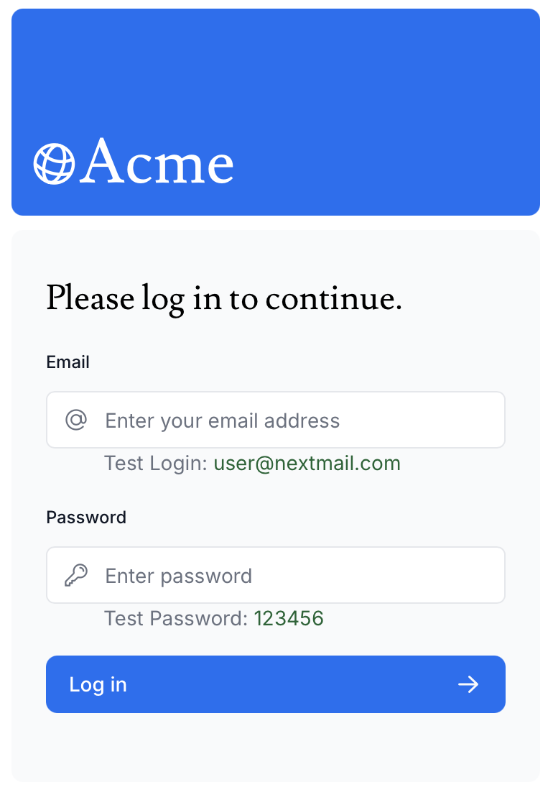

**Read in another language: [polski](README.pl.md).**

# Dashboard App

The "Dashboard" application is a financial management tool built with TypeScript and Next.js, designed to provide users with a clear overview of their financial data.

Key Features:

1. Dashboard Overview: Displays essential metrics, including:

- Collected Money: Total amount received.
- Pending Money: Amount yet to be received.
- Total Invoices: Count of all invoices.
- Total Customers: Number of customers.
- Recent Revenue: Latest revenue figures.

2. Invoice Management:

- Latest Invoices: Lists recent invoices.
- Create/Edit Invoice: Easily create and modify invoices.
- Search Invoices: Quickly find specific invoices.
- Pagination: Navigate through invoices effortlessly.

3. Customer Dashboard: Manage customer information and billing history.

4. User Authentication: Secure login system for safe access to data.

5. Database Integration: Connects to a Vercel-hosted SQL database for efficient data management.

The "Dashboard" application streamlines financial processes, making it an essential tool for businesses to manage invoices and track revenue effectively.

---

## Demo

Here is working live demo: ( https://nextjs-dashboard-one-theta-79.vercel.app/ )

---

## Site

### Leading page

### Create your own dashboard account or login if you already have registered

### It is so simply!

### You can search invoices.

### Or edit any invoice.

---

## Technologies

- SQL
- Next.js
- TypeScript

- Vercel

---

## Setup

Clone this repo to your desktop and run `pnpm install` to install all the dependencies.

---

## Usage

After you clone this repo to your desktop, go to its root directory and run `pnpm install` to install
its dependencies.

Once the dependencies are installed, you can run `pnpm dev` to start the application. You will then
be able to acces it at localhost:3000

---

## Feel free to share your opinion

- https://www.linkedin.com/in/klima96/
